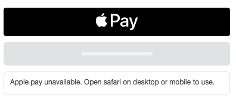

Add a digital wallet to the Square Payment form to accept payments with Apple Pay for Web, Google Pay, and Masterpass.


## Prerequisites

In order to enable digital wallets, the following must be true:
* You have followed the steps of the [Payment Form Setup Guide](paymentform.md).
* You are using your **Production Application ID**.

The setup guide implements the form with credit card inputs because Sandbox does not currently support digital wallets. If you want to only support digital wallet payments, you may remove all the credit card fields added [here](paymentform#6-add-the-credit-card-fields).

## 1. Add the location ID

To get your Sandbox location ID:

1. Open your [Application Dashboard](https://developers.squareup.com/apps).
1. Click on the application you want to use for the payment form. You should land on the "Credentials" tab.
1. On the bottom left corner, toggle "Sandbox Settings" to "Production Settings" .
1. Click on the "Locations" tab on the left navigation bar.
1. Copy the **Production Location ID**.

Add your location ID to the payment form:
```
<SquarePaymentForm
  locationId={PRODUCTION_LOCATION_ID}
/>
```

## 2. Add the payment request object

To process payments, you will need to add the `createPaymentRequest` callback function. This will create a JSON block that defines the payment request.

```
class PaymentPage extends React.Component {
  ...
  createPaymentRequest() {
    return {
      requestShippingAddress: false,
      requestBillingInfo: true,
      currencyCode: "USD",
      countryCode: "US",
      total: {
        label: "MERCHANT NAME",
        amount: "1",
        pending: false
      },
      lineItems: [
        {
          label: "Subtotal",
          amount: "1",
          pending: false
        }
      ]
    }
  }
  ...
  render() {
    <SquarePaymentForm
      {...props}
      createPaymentRequest={this.createPaymentRequest}
    />
  }
}
```

## 3. Add the digital wallet component

By default, the digital wallet options will not render anything if they are not ready to take payment. You can pass in views for when the digital wallet is being initialized (`loadingView`) or when the digital wallet is not available (`unavailableView`). We've provided some basic implementation below:

```javascript
const loadingView = <div className="sq-wallet-loading"></div>
const unavailableView = <div className="sq-wallet-unavailable">Unavailable</div>

// example usage:
// <ApplePayButton loadingView={loadingView} unavailableView={unavailableView} />
```



### Apple Pay

The payment form adheres to Apple's development requirements for Web Apple Pay. To use Web Apple Pay with the form, the following must be true:
* You are using HTTPS.
* You are using a production Square account.
* The payment form is loaded on a supported client:
  * Safari on iOS 10 and later
  * Safari on MacOS 10.12 and later
* Apple Pay on Web is only available for Square accounts based in the United States.

#### 1. Register your domain with Apple

By registering your domain to use Web Apple Pay and the Apple Pay Platform, you agree to the [Apple Pay Platform Web Merchant Terms and Conditions](https://developer.apple.com/terms/apple-pay-web/).

To register a domain for Web Apple Pay:
1. Open the [Application Dashboard](https://developers.squareup.com/apps).
1. Select the application associated with your payment form implementation.
1. Click on the "Apple Pay" tab for the selected application.
1. Click on the "Add a new domain" link and follow the onscreen instructions.
    1. Add the domain
    2. Download the verification file
    3. Host the verification file on your domain at **/.well-known/apple-developer-merchantid-domain-association**

#### 2. Add the Apple Pay placeholder to your payment page

Add the `ApplePayButton` component anywhere inside your `SquarePaymentForm`:

```
import { ApplePayButton } from 'react-square-payment-form'

<SquarePaymentForm {...props}>
  <ApplePayButton loadingView={loadingView} unavailableView={unavailableView} />
</SquarePaymentForm>
```

### Google Pay

To use Google Pay with the form, the following must be true:
* You are using HTTPS.
* You are using a production Square account.

Add the `GooglePayButton` component anywhere inside your `SquarePaymentForm`:

```
import { GooglePayButton } from 'react-square-payment-form'

<SquarePaymentForm {...props}>
  <GooglePayButton loadingView={loadingView} unavailableView={unavailableView} />
</SquarePaymentForm>
```


### Secure Remote Commerce (formerly Masterpass)

> Masterpass has migrated their digital wallet to Secure Remote Commerce (also known as Click to Pay). In order to minimize breaking changes, the Square Payment Form will continue to refer to original "Masterpass" objects, which remains unchanged with this migration.

The Masterpass button is available in both Sandbox and Production. There are no additional requirements.

Add the `MasterpassButton` component anywhere inside your `SquarePaymentForm`:

```
import { MasterpassButton } from 'react-square-payment-form'

<SquarePaymentForm {...props}>
  <MasterpassButton loadingView={loadingView} unavailableView={unavailableView} />
</SquarePaymentForm>
```
