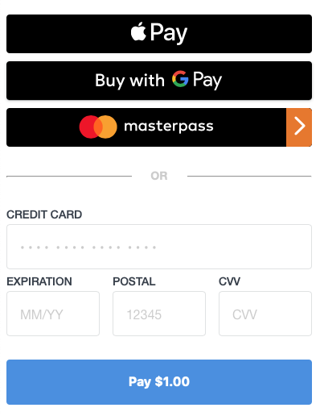

The React Square Payment Form provides a secure, PCI-compliant, customizable payment experience for accepting debit cards, credit, or digital wallet payments in your React app.

*Note: this SDK is in beta. We'll be improving it as we work towards GA - please leave feedback for our team!*

## Taking a Payment with Square

Taking online payments with Square is a 2-step process:

1. **[Generate a nonce](paymentform.md)**: Securely collect credit card & digital wallet information using the Square Payment Form and generate a nonce
2. **[Charge the Nonce](charging.md)**: Call Square's "Charge" endpoint with the amount and nonce on your backend server

A **nonce** is an encrypted token that lets you take payments with Square without handling real credit card numbers. It is generated by the payment form and holds information to identify the payment tender for an online payment. The generated nonce is used with Square's [Transactions API](https://docs.connect.squareup.com/payments/transactions/overview) to create charges.
