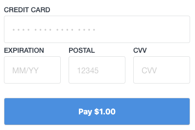

In this guide, we will build a simple payment form in Sandbox mode and generate a nonce that can be used to create a charge.

## 1. Create a Square developer account

To get started with the Square Payment Form, you will need to do the following:

1. [Create a Square Developer account](https://connect.squareup.com/apps).
1. [Create an application](https://developer.squareup.com/apps/new) and agree to our [developer terms of service](https://squareup.com/us/en/legal/general/developers).

## 2. Get your Sandbox credentials

To get your Sandbox credentials:

1. Open your [Application Dashboard](https://developer.squareup.com/apps/new).
1. Click on the application you want to use for the payment form. You should land on the "Credentials" tab.
1. On the top of the page, toggle to "Sandbox" .
1. Copy the **Sandbox Application ID**. This tells Square which developer is using the form to take payments.
1. Click on the "Locations" tab on the left navigation bar.
1. Copy the **Sandbox Location ID**.

## 3. Install the component

```
npm install --save react-square-payment-form
```

## 4. Import the component and styles

We provide default styles to make it easier to get set up.

```
import { SquarePaymentForm } from 'react-square-payment-form'
import 'react-square-payment-form/lib/default.css'
```

## 5. Add the SquarePaymentForm

The `SquarePaymentForm` is a wrapper that loads the SqPaymentForm JS library. It does not render anything on its own.

You will need to provide the the following fields:
* `applicationId` with your **Sandbox Application ID**
* `locationId` with your **Sandbox Location ID**
* `sandbox` with **true**. This is required in addition to using your sandbox ID.
* [`onCardNonceResponseReceived`](https://developer.squareup.com/docs/api/paymentform/?q=verificationdetails#cardnonceresponsereceived) This will be invoked with either a successful nonce or errors.
* [`createVerificationDetails`](https://developer.squareup.com/docs/api/paymentform/?q=verificationdetails#datatype-sqverificationdetails) This is used to verify the identity of the buyer using [Strong Customer Authentication](https://developer.squareup.com/docs/sca-overview?q=sca).

```
class PaymentPage extends React.Component {

  constructor(props) {
    super(props)
    this.state = {
      errorMessages: [],
    }
  }

  cardNonceResponseReceived = (errors, nonce, cardData, buyerVerificationToken) => {
    if (errors) {
      this.setState({ errorMessages: errors.map(error => error.message) })
      return
    }

    this.setState({ errorMessages: [] })
    alert("nonce created: " + nonce + ", buyerVerificationToken: " + buyerVerificationToken)
  }

  createVerificationDetails() {
    return {
      amount: "100.00",
      currencyCode: "USD",
      intent: "CHARGE",
      billingContact: {
        familyName: "Smith",
        givenName: "John",
        email: "jsmith@example.com",
        country: "GB",
        city: "London",
        addressLines: ["1235 Emperor's Gate"],
        postalCode: "SW7 4JA",
        phone: "020 7946 0532"
      }
    }
  }

  render() {
    return (
      <div>
        <h1>Payment Page</h1>

        <SquarePaymentForm
          sandbox={true}
          applicationId={SANDBOX_APPLICATION_ID}
          locationId={SANDBOX_LOCATION_ID}
          cardNonceResponseReceived={this.cardNonceResponseReceived}
          createVerificationDetails={this.createVerificationDetails}
        >
        </SquarePaymentForm>

        <div className="sq-error-message">
          {this.state.errorMessages.map(errorMessage =>
            <li key={`sq-error-${errorMessage}`}>{errorMessage}</li>
          )}
        </div>

      </div>
    )
  }
}
```

## 6. Add the credit card fields

We will use a credit card form to test the nonce creation. Digital wallets are not supported in Sandbox mode.

You must include all of the following components inside the `SquarePaymentForm`:
* `CreditCardNumberInput`
* `CreditCardExpirationDateInput`
* `CreditCardPostalCodeInput`
* `CreditCardCVVInput`
* `CreditCardSubmitButton`

These fields can be placed anywhere within the form and do not need to be in any specific order.
We have chosen to render the expiration date, postal code, and cvv on one line.

```
import {
  SquarePaymentForm,
  CreditCardNumberInput,
  CreditCardExpirationDateInput,
  CreditCardPostalCodeInput,
  CreditCardCVVInput,
  CreditCardSubmitButton
} from 'react-square-payment-form'

<SquarePaymentForm {...props}>

  <fieldset className="sq-fieldset">
    <CreditCardNumberInput />
    <div className="sq-form-third">
      <CreditCardExpirationDateInput />
    </div>

    <div className="sq-form-third">
      <CreditCardPostalCodeInput />
    </div>

    <div className="sq-form-third">
      <CreditCardCVVInput />
    </div>
  </fieldset>

  <CreditCardSubmitButton>
      Pay $1.00
  </CreditCardSubmitButton>

</SquarePaymentForm>
```

You should now see the credit card payment form.



## 7. Generate a nonce

We are ready to start creating nonces! Errors should render when you submit with an invalid credit card.

Fill in the form with the following test credit card information and click the "Pay" button. A nonce should be generated and an alert should appear on your browser.

* **Card Number**: 4111 1111 1111 1111
* **CVV**: any three non-consecutive numbers (ex. 123)
* **Expiration Date**: any month and year in the future (ex. 01/25)
* **Postal Code**: any postal code (ex. 12345)
