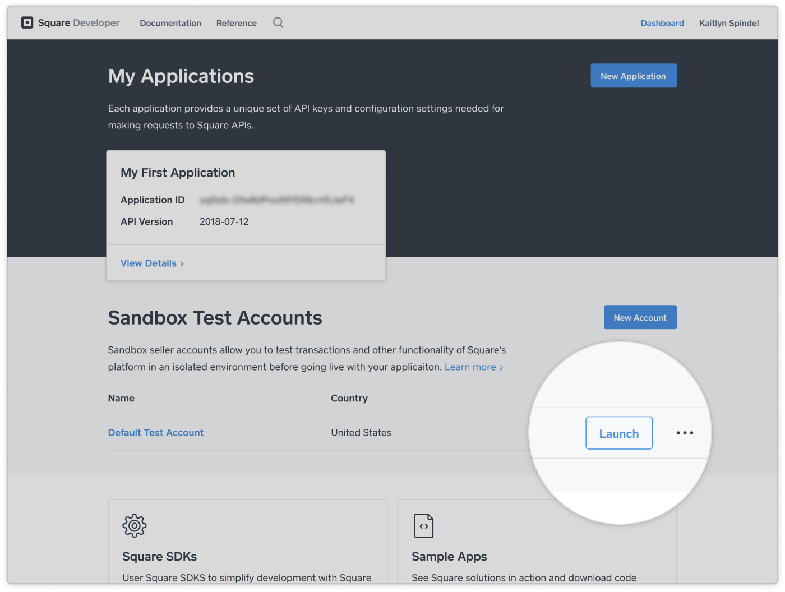
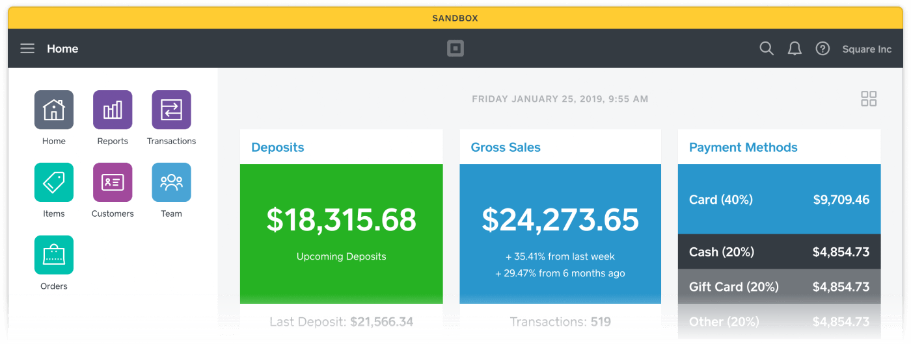

Create a payment from your backend in Sandbox using the nonce created from the `SquarePaymentForm`.

## Prerequisites

In order to generate a charge on a payment method, the following must be true:
* You have followed the steps of the [Payment Form Setup Guide](paymentform.md) and can successfully create a nonce.

## 1. Set up a backend endpoint

In this example, we will use a Ruby on Rails backend for payment processing.

```ruby
class PaymentsController < ApplicationController
  # endpoint: POST /payments
  def create
  end
end
```

## 2. Send the nonce to your backend

Send the nonce and buyer verification token created from `cardNonceResponseReceived` to your backend.

```
class PaymentPage extends React.Component {

  cardNonceResponseReceived = (errors, nonce, cardData, buyerVerificationToken) => {
    ...
    alert("nonce created: " + nonce)
    API.post('/payments', data: { nonce: nonce, token: buyerVerificationToken }) // implement this
  }
}
```

## 3. Get your Sandbox credentials

To get your Sandbox credentials:

1. Open your [Application Dashboard](https://connect.squareup.com/apps).
1. Click on the application you want to use for the payment form. You should land on the "Credentials" tab.
1. On the bottom left corner, toggle "Production Settings" to "Sandbox Settings".
1. Click on the "Show" link on the **Sandbox Access Token** and copy it.
1. Click on the "Locations" tab on the left navigation bar.
1. Copy the **Sandbox Location ID**.

## 4. Take a payment

On your backend, take this nonce and create a payment using Square's Payments API. You can read the [Payments and Refunds Overview](https://developer.squareup.com/docs/payments-api/overview) guide to learn how to create a payment.

```
def create
  payload = {
    "source_id": params[:nonce],
    "verification_token": params[:token],
    "autocomplete": true,
    "location_id": SANDBOX_LOCATION_ID,
    "amount_money": { # amount_money = $1.00
      "amount": 100,
      "currency" "USD"
    },
    "idempotency_key": SecureRandom.uuid
  }
  url = "https://connect.squareupsandbox.com/v2/payments"
  res = HTTP.auth("Bearer #{SANDBOX_ACCESS_TOKEN}").post(url, :body => payload.to_json)
  render json: res.body
end
```

The [idempotency key](https://developer.squareup.com/docs/working-with-apis/idempotency) should be generated as a UUID by the backend payment page.

## 5. See the payment in the Sandbox Seller Dashboard

You should now be able create and charge a nonce successfully.

The payment is credited to the sandbox test account whose OAuth token is used in the app that you just built. To see the payment in the sandbox seller dashboard:

1. Go to the [Developer Dashboard](https://developer.squareup.com/apps).
1. Click "Launch" on the default test account to access the sandbox seller dashboard.

1. Click "Transactions" to view the test payment.
