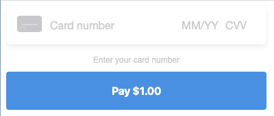

[Build a single-element payment form (Beta)](https://developer.squareup.com/docs/payment-form/payment-form-walkthrough#build-a-single-element-payment-form-beta)



## Prerequisites

Follow steps 1-5 of the [Payment Form Setup Guide](paymentform.md) before continuing.

## 6. Add the Simple Card component

Using the `SimpleCard` component is an alternative to building a payment form if you don't need the flexibility of individually placed payment card fields. [Read more about customizing the appearance](https://developer.squareup.com/docs/payment-form/cookbook/customize-form-styles#customize-the-appearance-of-the-single-element-payment-form).

```
import { SimpleCard } from 'react-square-payment-form'

<SquarePaymentForm {...props}>
  <SimpleCard />

  <CreditCardSubmitButton>Pay $1.00</CreditCardSubmitButton>
</SquarePaymentForm>
```

Only the first style object given to `SquarePaymentForm`'s `inputStyles` prop will be applied to `SimpleCard`.

## Caveats

_You can **NOT** use digital wallets with `SimpleCard`._ If you would also like to accept payments with Apple Pay for Web, Google Pay, and Masterpass, you'll need to create a separate instance of `SquarePaymentForm` with digital wallet configuration.

```js
render() {
    return (
      <>
        <SquarePaymentForm
          sandbox={true}
          applicationId={APPLICATION_ID}
          locationId={LOCATION_ID}
          cardNonceResponseReceived={this.cardNonceResponseReceived}
          createPaymentRequest={this.createPaymentRequest}
          createVerificationDetails={this.createVerificationDetails}
        >
          <ApplePayButton loadingView={loadingView} unavailableView={unavailableApple} />
          <GooglePayButton loadingView={loadingView} unavailableView={unavailableGoogle} />
          <MasterpassButton loadingView={loadingView} unavailableView={unavailableMasterpass} />
        </SquarePaymentForm>

        <SquarePaymentForm
          sandbox={true}
          applicationId={APPLICATION_ID}
          inputStyles={[{ fontFamily: 'monospace' }]}
          cardNonceResponseReceived={this.cardNonceResponseReceived}
        >
          <SimpleCard />

          <CreditCardSubmitButton>Pay $1.00</CreditCardSubmitButton>

          <div className="sq-error-message">
            {this.state.errorMessages.map(errorMessage => (
              <li key={`sq-error-${errorMessage}`}>{errorMessage}</li>
            ))}
          </div>
        </SquarePaymentForm>
      </>
    )
  }
```
